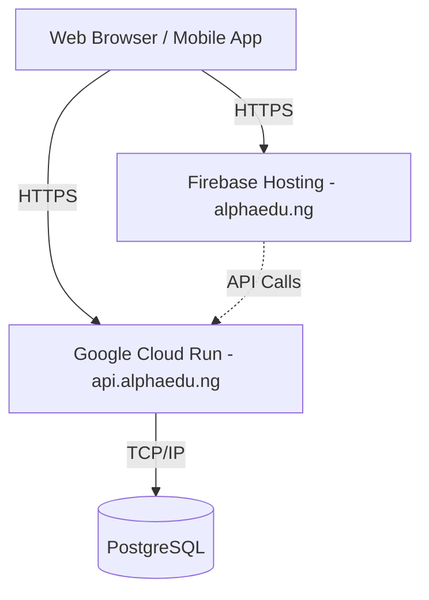

# AlphaEdu Deployment Architecture

This document describes the intended production deployment architecture for AlphaEdu.

## Overview
AlphaEdu utilizes Google Cloud and Firebase infrastructure to ensure scalability, security, and separation of concerns between the frontend client and the backend API.

## Frontend (Next.js)
- **Hosting**: Firebase Hosting
- **Domain**: `alphaedu.ng`
- **Details**: The Next.js web application is deployed via Firebase Hosting (which supports Next.js App Router natively or via Cloud Functions/Run under the hood for SSR). 

## Backend API (FastAPI)
- **Hosting**: Google Cloud Run
- **Domain**: `api.alphaedu.ng`
- **Details**: The FastAPI service is containerized using Docker and deployed to Google Cloud Run as a stateless, auto-scaling service. It acts as the sole gatekeeper to the database.

## Database (PostgreSQL)
- **Hosting**: Google Cloud SQL for PostgreSQL (Planned)
- **Access**: The PostgreSQL database is strictly accessed by the FastAPI backend. 
- **Security**: The frontend must **NEVER** connect directly to the database. All database access, business logic, and data manipulation must go through the FastAPI service.

## Architecture Diagram

## Future Mobile Support
The strict separation of the FastAPI backend on Cloud Run ensures that the same API can be reused for the future AlphaEdu mobile application without any changes to the core architecture.
